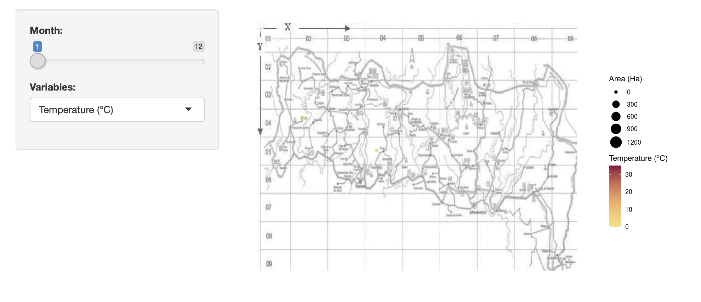
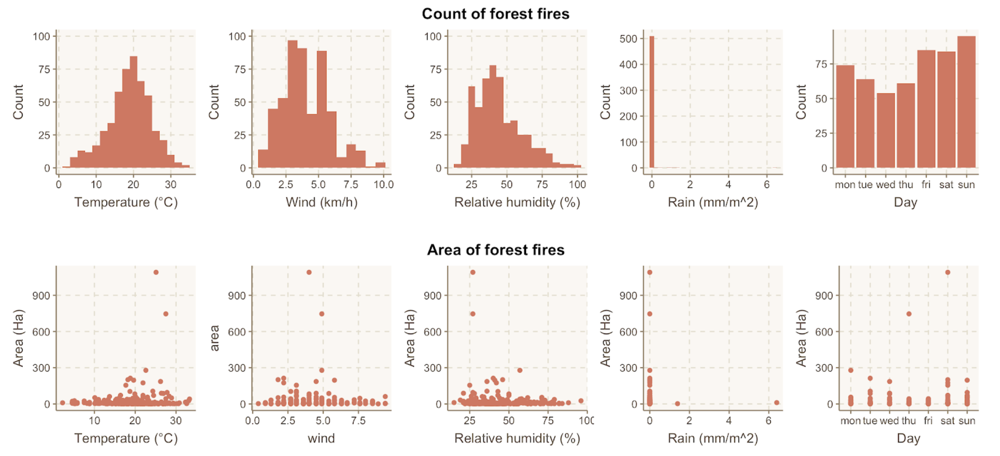
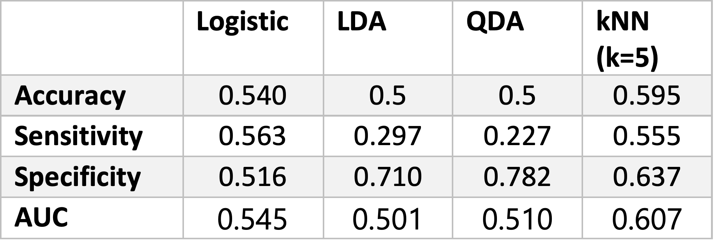

```{r setup, include=FALSE}
knitr::opts_chunk$set(echo = TRUE)
library(tidyverse)
library(dplyr)
library(broom)
library(olsrr)
library(ggplot2)
library(VGAM)
library(nnet)
library(DescTools)
library(ResourceSelection)
library(LogisticDx)
library(knitr)
library(mice)
library(caret)
library(leaps)
library(MASS)
library(glmnet)
library(splines)
library(splines2)
library(GGally)
library(ROCR)
library(tree)
library(randomForest)
library(pROC)
library(ROCR)
```

# Topic: Forest Fires in the Northeast Region of Portugal


## Overview and Motivation
* Provide an overview of the project goals and the motivation for it.

Forest fires are among the most common ecological disasters throughout the world. In the US, the ongoing record-breaking forest fires in California have caused great concerns. Although forest fires play an important role in the natural cycle, it poses devastating threats to local communities and biodiversity. Negative effects of forest fires include pollution, deforestation, health, as well as economic losses in terms of forest fire suppression. 
To better predict forest fires, forest fires modeling has been used in an attempt to characterize fire behavior and improve the safety of firefighters. Thus, we would like to identify significant variables in forest fires and develop a simple model to help understand the patterns of forest fires.


## Related Work
* Anything that inspired you, such as a paper, a web site, or something we discussed in class.

We were inspired by the forest fire data set from UCI machine learning repository. (http://archive.ics.uci.edu/ml/datasets/Forest+Fires). Considering the ongoing forest fire in California, we decided to choose this topic for this group project. The following paper gave us inspiration and guidance in exploring the dataset: [Cortez and Morais, 2007] P. Cortez and A. Morais. A Data Mining Approach to Predict Forest Fires using Meteorological Data. In J. Neves, M. F. Santos and J. Machado Eds., New Trends in Artificial Intelligence, Proceedings of the 13th EPIA 2007 - Portuguese Conference on Artificial Intelligence, December, Guimarães, Portugal, pp. 512-523, 2007. APPIA, ISBN-13 978-989-95618-0-9. 


## Initial Questions: 
* What questions are you trying to answer? How did these questions evolve over the course of the project? What new questions did you consider in the course of your analysis?

The first question we would like to answer is what are the influential factors in predicting forest fires.  Initially, we would like to use visualization to explore the data set, and then then use regression analysis to investigate significant variables. After learning shiny app, we decided to incorporate it into the visualization section to better illustrate the time-dependent distribution. As the course progressed, we were exposed to various modeling methods for machine learning and formed a more concrete idea about use modeling to predict forest fires.


## Data: Source, scraping method, cleanup, etc.

The forest fire data we use is from Montesinho Natural Park in the northeast region of Portugal collected from January 2000 to December 2003 with a total of 517 entries. (weblink:http://archive.ics.uci.edu/ml/datasets/Forest+Fires)
Features of forest fires include spatial information of forest fire according to a 9x9 grid map, temporal information, the forest Fire Weather Index (FWI), and meteorological information. 

For temporal information, month and day were selected to take into account of both natural factor and human cause; four weather attributes—FFMC, DMC, DC, and ISI—were chosen for FWI; meteorological information includes temperature, relative humidity, wind speed, outside rain, and the burned area of the forest.


```{r}
# Add season category 
fire <- read.csv("forestfires.csv", header=TRUE, sep = ",")
fire$season <- rep("spring", 517)
for (i in 1:517){
if (fire$month[i] %in% c("feb","jan","dec")) fire$season[i] <- "winter"
if (fire$month[i] %in% c("oct","nov","sep")) fire$season[i] <- "autumn"
if (fire$month[i] %in% c("aug","jul","jun")) fire$season[i] <- "summer"
}
fire$season <- as.factor(fire$season)

fire$season.cat <- rep(0, 517)
for (i in 1:517){
  if (fire$season[i] == "summer") {
    fire$season.cat[i] <- 1
  }
  if (fire$season[i] == "autumn") {
    fire$season.cat[i] <- 2
  }
  if (fire$season[i] =="winter") {
    fire$season.cat[i] <- 3
  }
}
head(fire)
```


Our dataset was good for analysis, no additional scraping was needed. Thus, for the cleanup, we were more focused on identifying any outliers or potential influential points that may affect our regression model fitting. 

Since one regression model we were trying to fit is linear regression model which has an assumption of normality and our outcome burning area is not normally distributed, thus we did a log transformation on the burning areas above 0 to approximate normal distribution. Next, we identified ourliers and potential influential points in our dataset based on leverage and Cook's Distance.


```{r,out.width="60%",fig.show='hold'}
# Area log transformation (for area>0)
hist(fire$area,40, main = "Histogram of area", xlab = "Area")
fire["logarea"] <- ifelse(fire$area >0, log(fire$area), NA)
ggplot(data=fire, aes(x=logarea))+
  geom_histogram(aes(y=..density..), col="black",fill="white")+
  stat_function(fun=dnorm, args = list(mean=mean(fire$logarea, na.rm = TRUE), sd = sd(fire$logarea, na.rm=TRUE)),col="red")
```


```{r,out.width="50%",fig.show='hold'}
# Outliers / Cook's Distance
area_posit <- fire[which(fire$area>0),]
mod_lin <- lm(logarea ~X+Y+month+day+FFMC+DMC+DC+ISI+temp+RH+wind+rain, data=area_posit[c(seq(1,12),15,16)])
ols_plot_cooksd_bar(mod_lin)  #number 262 datapoint in this data set, which is id=500
ols_plot_resid_lev(mod_lin)
ols_plot_dffits(mod_lin)

cooksd <- cooks.distance(mod_lin)
plot(cooksd, pch="*", cex=2, main="Influential Obs by Cooks distance")  # plot cook's distance
abline(h = 4*mean(cooksd, na.rm=T), col="red")  # add cutoff line
text(x=1:length(cooksd)+1, y=cooksd+0.001, labels=ifelse(cooksd>4*mean(cooksd, na.rm=T),names(cooksd),""), col="red")

# Get rid off the outliers
influential = which(cooksd>4*mean(cooksd, na.rm=T))  # influential points
influ <- area_posit[influential, ]   #all data for influential points
influ
dat <- area_posit[-influential,]  #get rid off the influential points
head(dat)
```


 We created a new data set excluding these points and wanted to see if fitting our regression models without these influential points helped improve our model fitting.
 
```{r}
# New Dataset
new_dat <- rbind(fire[which(fire$area==0),], dat)   #join the area_positive w/o influential points to the data w/ area=0
new_dat$burn <- ifelse(new_dat$area==0,0,1)  #to get the new dataset without the influential points
head(new_dat)
md.pattern(new_dat)  #no missing value
summary(new_dat)
```


## Exploratory Analysis: 
* What visualizations did you use to look at your data in different ways? What are the different statistical methods you considered? Justify the decisions you made, and show any major changes to your ideas. How did you reach these conclusions?

We used R shiny app to visualize our data, getting a rough idea of frequency, size, and distribution of forest fires. We were interested in weather observations that are associated with the FWI index: temperature, relative humidity, wind speed, and rain. For each of these variables, a plot is generated to describe its relationship with forest fires by month. To get a more direct interpretation, we also plotted the count and area of forest fires by variables of interest. The R shiny app is in the github repository and is also shown on google site. The following pictures are the screenshots of the shiny app.

{width=50%} {width=50%}


For statistical methods, we used linear regression model and logistic regression model based our data. Since our outcome in our data is burning area which is a continuous variable and is not a count, we considered linear regression model; then we categorize the outcome as a binary outcome -- burn = 1 if burning area>0, burn = 0 if burning area =0, logistic regression model is being used here. By comparing these regression models, we mainly looked at $R^2$, adjusted $R^2$, square root of MSE (mean squared error) for linear regression models, AUC, GOF (goodness-of-fit) test for logistic regression models and AIC and BIC for all. 

After learning about machine learning, we selected important variables in logistic regression models and used them to predict whether or not there's going to have forest fires. We mainly focused on accuracy, specificity, sensitivity and AUC to compare machine learning models. 

Below are the codes for linear, logistic regression models and machine learning models. 
  

#### Linear Regression Models
```{r, out.width="70%",fig.show='hold'}
# Fit linear regression model to area>0 since this is normally distributed
area_posit <- fire[which(fire$area>0),]
summary(area_posit)
head(area_posit)

# Scatterplot with lowess curve
ggplot(data=area_posit, aes(x=DMC, y=logarea))+
  geom_point()+
  geom_smooth(method = "loess",se=FALSE)+
  theme_bw()

# Fit linear regression model with full dataset
mod_lin <- lm(logarea ~X+Y+month+day+FFMC+DMC+DC+ISI+temp+RH+wind+rain, data=area_posit[c(seq(1,12),15,16)])
summary(mod_lin)  # DMC and DC are being statistically significant 
tidy(mod_lin)

#Fit linear regression again, now without the influential points and outliers
mod_lin2 <- lm(logarea ~X+Y+month+day+FFMC+DMC+DC+ISI+temp+RH+wind+rain, data=dat)
summary(mod_lin2)

plot(mod_lin2, which=c(1,2,3))
```
From the coefficients and P-values of this linear model fitting using the full dataset, we can see that DMC (p-value <0.001) and DC (p-value<0.05) are statistical significant.

From the coefficients and P-values of this linear model fitted using the dataset without the potential influential points, we can see that DMC and DC are still statistically significant, and now we have another statistically significant variable,  'monthoct' (p-value <0.05).  Also, in this model, we have more variables with P-value close to 0.05.

We also check the LINE (Linearity, Independence, Normality, Equal variance) assumption for second linear regression model: seeing the plot of residuals vs. fitted for #2 model, the linearity and equal variance assumption of linear regression model holds here -- the data points equally spread across the zero line. Seeing the normal Q-Q plot for #2 model, the normality assumption of linear regression model holds here -- data point does not deviate much from the line.


```{r}
table_12<- matrix(c(summary(mod_lin)$r.squared, summary(mod_lin)$adj.r.squared, sqrt(mean(mod_lin$residuals^2)),AIC(mod_lin), BIC(mod_lin),
                  summary(mod_lin2)$r.squared, summary(mod_lin2)$adj.r.squared, sqrt(mean(mod_lin2$residuals^2)),AIC(mod_lin2), BIC(mod_lin2)), ncol=5,nrow=2, byrow=TRUE)
colnames(table_12)<- c("R^2", "Adjusted R^2", "Square root of MSE","AIC", "BIC")
rownames(table_12)<- c("logarea ~.",
                     "logarea~., (w/o influential points)")
table_12 <- as.table(table_12)
kable(table_12)
```

We compared these two models (#1 & #2) by values of R^2, adjusted R^2, square root of MSE, AIC and BIC. We would prefer higher value of R^2, adjusted R^2, and smaller values of square root of MSE, AIC and BIC. Here, the model fitted using dataset without the influential points have larger number of R^2, adjusted R^2, and smaller number of square root of MSE, AIC and BIC, indicating the 2nd model fits the data better. Therefore, in the further model fitting, we will use the dataset without influential points for better prediction. 

Since we have a lot of variables to be considered, we also tried linear model with forward selection and backward elimination based on AIC value.
```{r, out.width="50%", fig.show='hold'}
# Linear model with forward selection & backward elimination based on AIC
full.model <- lm(logarea ~., data = dat[c(seq(1,12),15,16)])
step.forw <- step(lm(logarea~1, data=dat[c(seq(1,12),15,16)]), ~X+Y+month+day+FFMC+DMC+DC+ISI+temp+RH+wind+rain, direction = "forward")
step.back <- step(full.model, direction = "backward")
summary(step.forw)
summary(step.back)

plot(step.back, 1:3)


```


In the forward selection model, only the ISI predictor being selected, but with a not very statically significant P-value. 
In the backward elimination model, more predictors are selected. Also, 'monthdec', 'monthoct', 'monthsep', DMC and DC are statically significant with p-values <0.05.

Finally, we compared these three fitted linear regression models on R^2, adjusted R^2, square root of MSE, AIC and BIC, to see which one performs the best. 

```{r}
table1<- matrix(c(summary(mod_lin)$r.squared, summary(mod_lin)$adj.r.squared, sqrt(mean(mod_lin$residuals^2)),AIC(mod_lin), BIC(mod_lin),
                  summary(mod_lin2)$r.squared, summary(mod_lin2)$adj.r.squared, sqrt(mean(mod_lin2$residuals^2)),AIC(mod_lin2), BIC(mod_lin2),
                  summary(step.forw)$r.squared, summary(step.forw)$adj.r.squared, sqrt(mean(step.forw$residuals^2)),AIC(step.forw), BIC(step.forw),
                  summary(step.back)$r.squared, summary(step.back)$adj.r.squared, sqrt(mean(step.back$residuals^2)),AIC(step.back), BIC(step.back)), ncol=5,nrow=4, byrow=TRUE)
colnames(table1)<- c("R^2", "Adjusted R^2", "Square root of MSE","AIC", "BIC")
rownames(table1)<- c("logarea ~.",
                     "logarea~., (w/o influential points)",
                     "model with forward selection based on AIC",
                     "model with backward elimination based on AIC")
table1 <- as.table(table1)
kable(table1)
```

From the summary table above, the forward selection model is the worst. Although the square root of MSE is a bit higher for the backward elimination model compared to the full model, the adjusted R^2 is higher and AIC and BIC values are smaller. 
Hence, the backward elimination model is considered the best one among these linear regression models. However, from the R^2 value, this model still only explains about 10.7% of the data. We then tried logistic regression model.


#### Logistic Regression Models
We categorize the outcome as a binary outcome -- burn = 1 if burning area>0, burn = 0 if burning area =0.

```{r, out.width="60%", fig.show='hold'}
# Fit Logistic Regression
lg_burn <- glm(burn ~ X+Y+month+day+FFMC+DMC+DC+ISI+temp+RH+wind+rain, family=binomial(link = "logit"),data=new_dat)
summary(lg_burn)

hoslem.test(new_dat$burn, fitted(lg_burn), g=10)  #not a poor fit (small P-value, poor fit, H0:good fit)
gof(lg_burn)  #AUC=64.0%

```


Given the coefficients of the first logistic regression model, we can see that other variables all being not statistically significant except for the intercept. Only temperature and rain's P-values are the lowest and closest to the significance level. All variables in our model are continuous. Thus, due to large number of covariate patterns, we used Hosmer and Lemeshow goodness of fit (GOF) test. Given the P-value = 0.5797 > 0.05 from the GOF test, we fail to reject the null hypothesis that this is a good fit. Therefore, from Hosmer and Lemeshow GOF test, this logistic regression model seems to have a good fit. We then plotted the Receiver Operating Curve (ROC) and see the area under the curve (AUC). The larger the AUC, the better the fitting. Here, AUC = 64.0%, which is acceptable. Then, we tried to improve the model for better fitting by including quadratic terms, based on the significant variables in the linear regression model and two variables being close to the significance level from the previous logistic regression model,.


```{r}
lg_burn2 <- glm(burn ~X+Y+month+day+FFMC+I(FFMC^2)+DMC+I(DMC^2)+DC+I(DC^2)+ISI+temp+I(temp^2)+RH+wind+rain+I(rain^2), family=binomial(link = "logit"), data=new_dat)
summary(lg_burn2)
hoslem.test(new_dat$burn, fitted(lg_burn2), g=10) #not a poor fit
gof(lg_burn2) #AUC=66.4%
anova(lg_burn, lg_burn2, test="Chisq")
```

From the coefficients of the variables, we can see that there're more variables close to the significance level (P-value=0.05) and much closer than those in #1. In this logistic regression model, DMC and temperature seem to be the influential and significant predictors. 

We also used Hosmer and Lemeshow goodness of fit (GOF) test again for the new logistic regression model. Since the P-value=0.8867 > 0.05, fwe ail to reject the null hypothesis that this is a good fit. This time, the p-value is larger than the first model. Again, from the Hosmer and Lemeshow GOF test, the #2 logistic model also seems to be a good fit. Look at the ROC curve and AUC, now AUC=64.7%, larger than the first model. And we know that larger the AUC, the better the model fit. Thus, after adjusting for these variables, the model seems to have a better fit. 

Besides the Hosmer and Lemeshow GOF test and ROC curve, we further compared these two logistic regression models with Likelihood Ratio Test (LRT) which follows a Chi-square distribution since our two models are nested. H0: reduced model is sufficient (here, logistic #1 is sufficient) and H1: full model is preferred (here, logistic #2 is preferred). Since P-value=0.002567 < 0.05, we reject the null hypothesis that reduced model is sufficient. Therefore, logistic model #2 is preferred and we need these quadratic terms in the model. 


```{r}
table3<- matrix(c(AIC(lg_burn), BIC(lg_burn),
                  AIC(lg_burn2), BIC(lg_burn2)), ncol=2,nrow=2, byrow=TRUE)
colnames(table3)<- c("AIC", "BIC")
rownames(table3)<- c("logistic model #1",
                     "logistic model #2")
table1 <- as.table(table3)
kable(table3)
```


#### Machine Learning Models
Finally, we decided to predict the occurrence of forest fire using machine learning. Based on the result from regression analysis, we selected the most significant predictors (X, Y, FFMC, DMC, DC, ISI, temp, RH, wind) from all variables in the modeling process. 

Since we would like to predict a binary outcome, i.e. whether there would be forest fire or not, we used classification models including logistic machine learning model, linear discriminant analysis (LDA), quadratic discriminant analysis (QDA), k-nearest neighbors (knn), classification tree, and random forest. In the modeling process, we divided the dataset in half for training and testing sets. 

```{r}
y <- new_dat$burn
set.seed(1)
train_index <- createDataPartition(y, times = 1, p = 0.5, list = FALSE)
train_set <- new_dat[train_index, ]
test_set <- new_dat[-train_index, ]

#Logistic Machine Learning
logistic_fit <- glm(burn~X+Y+month+day+FFMC+I(FFMC^2)+DMC+I(DMC^2)+DC+I(DC^2)+ISI+temp+I(temp^2)+RH+wind+rain+I(rain^2), train_set, family=binomial(link = "logit"))
p_hat_logit <- predict(logistic_fit, newdata=test_set)
y_hat_logit <- ifelse(p_hat_logit>0.5, 1,0)
confusionMatrix(data=as.factor(y_hat_logit), reference = as.factor(test_set$burn))
```


```{r,fig.width="60%", fig.show='hold'}
# QDA & LDA
set.seed(1)
train_index <- createDataPartition(y, times = 1, p = 0.5, list = FALSE)
train_set <- new_dat[train_index, ]
test_set <- new_dat[-train_index, ]
qda_fit <- qda(burn ~ X+Y+FFMC+DMC+DC+ISI+temp+RH+wind, data = train_set)
qda_preds <- predict(qda_fit, test_set)
confusionMatrix(data=as.factor(qda_preds$class), reference = as.factor(test_set$burn))


lda_fit <- lda(burn ~ X+Y+FFMC+DMC+DC+ISI+temp+RH+wind, data = train_set)
lda_preds <- predict(lda_fit, test_set)
confusionMatrix(data = as.factor(lda_preds$class), reference = as.factor(test_set$burn))

p1 <- prediction(p_hat_logit, test_set$burn) %>% performance(measure = "tpr", x.measure="tnr")
p2 <- prediction(qda_preds$posterior[,2], test_set$burn) %>% performance(measure = "tpr", x.measure="tnr")
p3 <- prediction(lda_preds$posterior[,2], test_set$burn) %>% performance(measure = "tpr", x.measure="tnr")

p2 %>% plot(main="QDA ROC",xlim=c(1.5,-0.5))
p3 %>% plot(main="LDA ROC",xlim=c(1.5,-0.5))


# Logistic regression AUC
prediction(p_hat_logit, test_set$burn) %>%
  performance(measure = "auc") %>%
  .@y.values   #0.545


# QDA AUC
prediction(qda_preds$posterior[,2], test_set$burn) %>%
  performance(measure = "auc") %>%
  .@y.values   #0.510

# LDA AUC
prediction(lda_preds$posterior[,2], test_set$burn) %>%
  performance(measure = "auc") %>%
  .@y.values  #0.541

# Knn
knn_fit <- knn3(burn~X+Y+FFMC+DMC+DC+ISI+temp+RH+wind, data = train_set,k=5)
knn_hat <- predict(knn_fit, test_set, type = "class")
tab <- table(pred=knn_hat, truth=test_set$burn)
confusionMatrix(tab)

knn_prob <- predict(knn_fit, test_set, type="prob")[,2]
plot(performance(prediction(knn_prob, test_set$burn), "tpr", "tnr"),main="KNN ROC", xlim=c(1,0))
prediction(knn_prob, test_set$burn) %>%
  performance(measure = "auc") %>%
  .@y.values  #0.607

plot(p1, col="red",xlim=c(1.5,-0.5), main="Logistic, LDA, QDA, kNN ROC Plot")
plot(p2, add=TRUE, col="blue")
plot(p3, add=TRUE, col="green")
plot(performance(prediction(knn_prob, test_set$burn), "tpr", "tnr"),add=TRUE,col="hot pink")
```

{width=70%}

Among these four models, kNN with k=5 has the greatest accuracy and the most balanced sensitivity and specificity. It also has the highest AUC value. The logistic model has slightly lower values for these parameters but still pretty balanced. Therefore, we chose kNN and logistic model over the other two.


```{r,out.width="60%", fig.show='hold'}
## Classification tree, Random Forest
set.seed(1)
# Classification Tree
train_index <- createDataPartition(y, times = 1, p = 0.5, list = FALSE)
train_set <- new_dat[train_index, ]
test_set <- new_dat[-train_index, ]
train_set$burn <- as.factor(train_set$burn)
test_set$burn <- as.factor(test_set$burn)

tree_fit <- tree(burn ~X+Y+FFMC+DMC+DC+ISI+temp+RH+wind, data=train_set)
summary(tree_fit)
pred <- predict(tree_fit, test_set,type = "class")
confusionMatrix(as.factor(pred), reference = test_set$burn)

plot(tree_fit, type = "uniform")
text(tree_fit, cex = 1)

cv_tree <- cv.tree(tree_fit)
plot(cv_tree)
best.size <- cv_tree$size[which(cv_tree$dev==min(cv_tree$dev))] # which size is better?
best.size
prune_fit <- prune.tree(tree_fit, best = 4)
plot(prune_fit, type="uniform")
text(prune_fit)

# Random Forest
rf <- randomForest(burn~X+Y+FFMC+DMC+DC+ISI+temp+RH+wind, data = train_set)
rf
preds_rf <- predict(rf, test_set)
confusionMatrix(as.factor(preds_rf), reference = test_set$burn)

varImpPlot(rf,main = "Random Forest Important Variable Plot")
```
Using the cv.tree function, we determined the optimal number of terminal nodes to be 4. For this model, the accuracy is 0.504, while the sensitivity (0.1563) and specificity (0.8629) are extremely unbalanced. We would not consider it a good model to predict forest fires. 

For the random forest model, the accuracy is 0.5317, which is slightly lower than the logistic model and kNN model. The sensitivity (0.4766) and specificity is relatively balanced (0.5887). Thus, this model is suitable for classifying the outcome of forest fire.


## Final Analysis: What did you learn about the data? How did you answer the questions? How can you justify your answers?

From the Shiny app and plots, forest fires are most common during August and September, and most frequently occur at temperature around 20 °C and relative humidity around 40%. The distribution for wind speed is more spread out. Since the frequency and burning area of forest fires does not vary significantly between during weekdays and weekends, human activity does not have a great impact on forest fires. 

Although the number of occurrence of forest fires are not linearly associated with weather observations, forest fires of large scale are more likely to occur under high temperature and low humidity.

For regression analysis, from previous analysis, backward elimination based on AIC linear regression model is the best among linear regression models and second logistic model is the best among two logistic models. After comparing these two models, we concluded that the second logistic regression model is the best fitting one from the below table. 
```{r}
tablefinal<- matrix(c(AIC(step.back), BIC(step.back),
                  AIC(lg_burn2), BIC(lg_burn2)), ncol=2,nrow=2, byrow=TRUE)
colnames(tablefinal)<- c("AIC", "BIC")
rownames(tablefinal)<- c("linear #4: model with backward elimination based on AIC",
                     "logistic model #2")
tablefinal <- as.table(tablefinal)
kable(tablefinal)
```
By comparing the P-values, we ranked the most significant variables as following: X, Y, FFMC, DMC, DC, ISI, temp, RH, wind.

For machine learning models, we considered kNN model, logistic model, and random forest model the best models to predict forest fires because they have the highest accuracy value and most balanced specificity and sensitivity.


